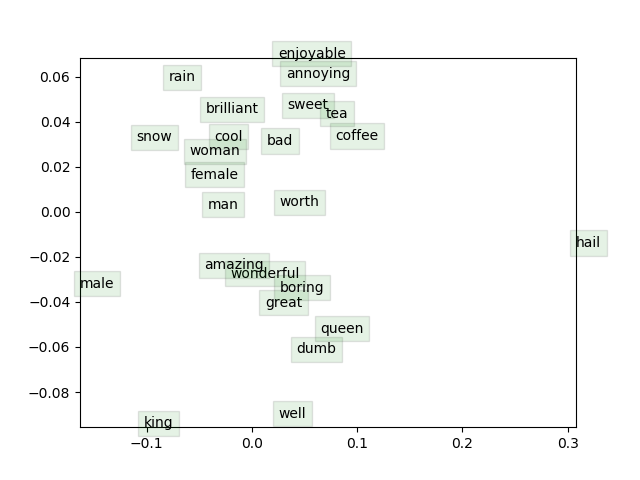

# Assignment-2: Understanding & Implementing word2vec

Tasks done in this assignments are:

1. Prove that the naive-softmax loss  is the same as the cross-entropy.
2. Compute the partial derivative of centre and outside words with naive-softmax criteria.
3. Find the derivative of ReLU and sigmoid function.
4. Compute the partial derivative of centre and outside words with negative sampling introduced by T Mikolov.
5. Coding: Implementing word2vec by writing codes for sigmoid, naiveSoftmaxLossAndGradient, negSamplingLossAndGradient, skipgram and SGD.

Visualization for the word vectors obtained after training:

