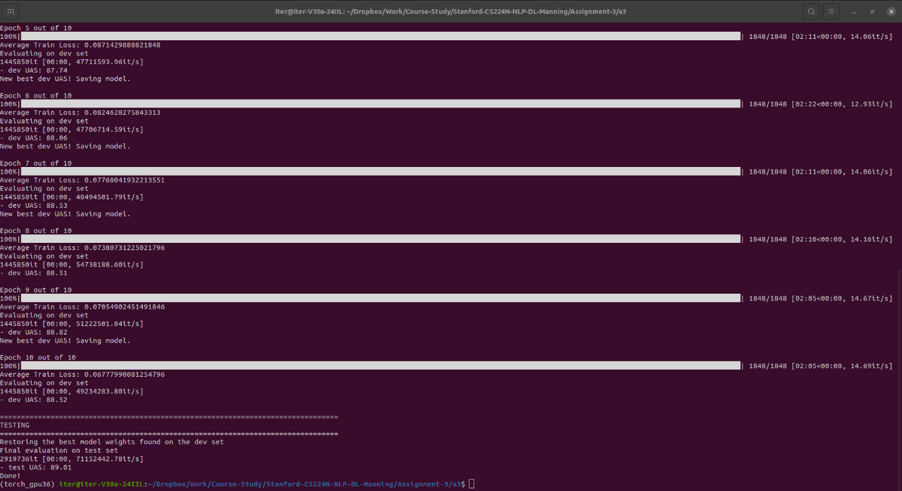

# Assignment-3: Dependency Parsing

Tasks done in this assignments are:

1. Understanding Adam: an optimizer.
2. Understanding Dropout: a regularization technique.
3. Implementing modules, like parser_transitions, parser_model for Neural Transition-Based Dependency Parsing.
4. Providing the estimated best UAS your model achieves on the dev set and the UAS it achieves on the test.
5. Pointing out incorrect Dependency Error in the given four sentences with suggesting the correct Dependency in response.

Screenshot of the training/testing of Neural Transition-Based Dependency Parsing:

