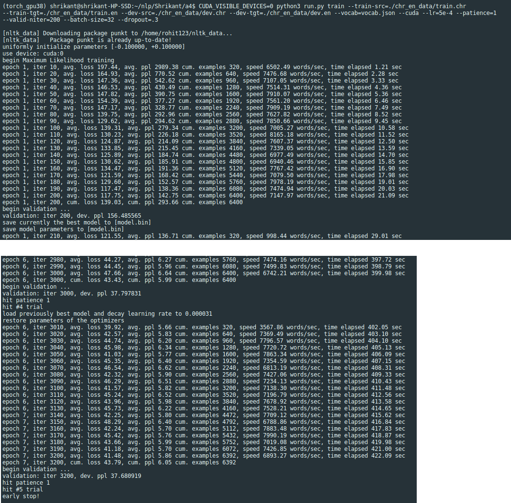
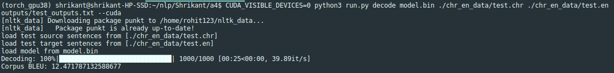

# Assignment-4: Neural Machine Translation with RNNs and Analyzing NMT Systems

Tasks done in this assignments are:

1. Understanding Neural Machine Translation (NMT) with RNNs.
2. Implementing modules, like pad_sents, model_embeddings, encoder/decoder for Cherokee-to-English NMT.
4. Analyzing NMT Systems, by answering various translation related questions on Cherokee-to-English NMT output.
5. Understanding and solving numerical problems on BLEU score.

Screenshot of the training of Cherokee-to-English NMT:

\
Screenshot of the testing of Cherokee-to-English NMT:

